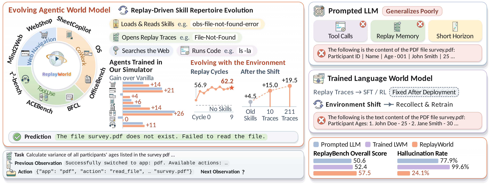
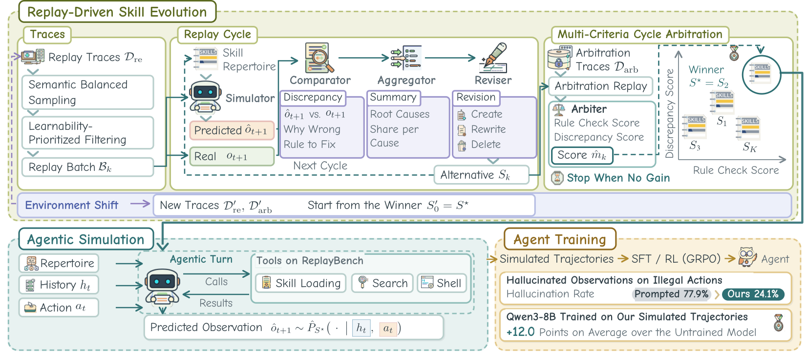

<div align="center">


<h3>🌍 Evolving Agentic World Model for Agent Training</h3>

<p><i>🕶️ Anonymous code release for double-blind review</i></p>

<p>
<b>🔁 Replay-Driven Skill Evolution</b> &nbsp;•&nbsp;
<b>🤖 Agentic Simulation</b> &nbsp;•&nbsp;
<b>🎓 Agent Training</b>
</p>

<p>
✨ Highlights &nbsp;|&nbsp;
🧭 Overview &nbsp;|&nbsp;
🔧 Setup &nbsp;|&nbsp;
🚀 Quick start &nbsp;|&nbsp;
📥 Collect &nbsp;|&nbsp;
🔁 Evolve &nbsp;|&nbsp;
🤖 Simulate &nbsp;|&nbsp;
📊 Evaluate
</p>



</div>

<br>

**ReplayWorld** is an agentic world model for eight environments in web navigation, CoWork and tool use. Each prediction is an *agentic turn*: a short loop of replies with tool calls that ends in the predicted observation. The simulator consults a **repertoire of simulator skills** that encode how environments respond to actions, and **replay-driven skill evolution** writes recurring discrepancies between predicted and recorded observations into these skills.

## ✨ Highlights

- 🤖 **An agentic world model.** The simulator runs as an agent: it opens the skills it needs and calls tools before it answers with the next observation.
- 🔁 **Replay-driven skill evolution.** Logged steps are replayed, and recurring discrepancies between predicted and recorded observations are written into the skills.
- 🎯 **Semantic balanced sampling (SBS)** promotes replay diversity.
- 🔍 **Learnability-prioritized filtering (LPF)** focuses selection on learnable traces.
- ⚖️ **Multi-criteria cycle arbitration (MCCA)** selects the best repertoire through independent validation.
- 📈 **Results.** On ReplayBench, a benchmark of 2,080 real environment transitions scored on six criteria, ReplayWorld outperforms its prompted backbone by 4.2 points. The agent trained on ReplayWorld trajectories gains 12.0 points on average across eight agent benchmarks.

<br>

<div align="center">



</div>

## 🧭 Overview

The pipeline:

| | Step | Introduction | What it does | Entry point |
|:-:|:--|:--|:--|:--|
| 📥 | **1&nbsp;·&nbsp;Collect** | *Replay Corpus and Test Set Construction* | Runs task queries in real environments and logs the traces, or converts released trace corpora | `scripts/collect.sh` |
| 🔁 | **2&nbsp;·&nbsp;Evolve** | *Replay-Driven Skill Evolution*, Algorithm&nbsp;1 | Replay-driven skill evolution: SBS, LPF, the Comparator, Aggregator and Reviser, and MCCA | `scripts/evolve.sh` |
| 🤖 | **3&nbsp;·&nbsp;Simulate** | *Agentic Simulation with the Evolved Repertoire* | Predicts observations with the selected repertoire in an agentic turn | `scripts/simulate.sh` |
| 📊 | **4&nbsp;·&nbsp;Evaluate** | *Evaluating World Models on ReplayBench* | Rates the simulator on test traces with the six ReplayBench criteria | `scripts/evaluate.sh` |

The walkthrough uses 🛒 WebShop as the worked example: its collectors, prompts, settings, repertoires and sample data are included. The other seven environments go through the same steps with their own sources, prompts and settings, described in the appendix of the paper.

### 🎛️ What a run selects

A config file sets the environment, the model, the traces, the repertoires and the harness of a run. For example, `configs/webshop.yaml`:

| Choice | Config key | Configuration |
|:--|:--|:--|
| 🌐 Environment | `environment` | `webshop` |
| 🧠 Model that plays every role | `simulator.model` `simulator.api_base` | Qwen3.5-397B-A17B behind an OpenAI-compatible endpoint |
| 📼 Replay and arbitration traces | `data.replay_traces` `data.arbitration_traces` | the traces collected in Step 1 |
| 🧩 Repertoires | `repertoire.initial` `repertoire.selected` | `repertoires/webshop_initial` (the six skills Step 2 starts from) and `repertoires/webshop` (the selected repertoire Steps 3 and 4 read) |
| ⚙️ Settings of the replay loop | `evolve.*` | the WebShop values ([`assets/settings.md`](assets/settings.md)) |
| 🧰 Capabilities of the harness | `harness.capabilities` `harness.replay_capabilities` | `coding` in Steps 3 and 4, none in replay |

The model evolves one repertoire per environment ([`assets/environments.md`](assets/environments.md)). An environment enters the pipeline through its trace collectors, its environment module (parse check, response types, rule checks), its prompts, its settings, its repertoires and, where it has one, a format exemplar; for WebShop these are `collect/`, `replayworld/environments/webshop.py`, `prompts/webshop/`, `configs/webshop.yaml`, `repertoires/` and `harness_inputs/webshop/`.

## 📁 Repository layout

```
.
├── collect/                     Step 1 · the four sources of the WebShop replay corpus, and the replay/arbitration split
├── replayworld/                 Steps 2 to 4 · shared by all environments
│   ├── evolve.py                  Algorithm 1, the replay loop
│   ├── sbs.py, lpf.py             SBS and LPF
│   ├── replay.py, roles.py        replay of one step per trace; Comparator, Aggregator, Reviser
│   ├── repertoire.py, mcca.py     skills, the update operator ⊕, consolidation; MCCA and the Arbiter
│   ├── simulator.py               the simulator, whose predictions are agentic turns
│   ├── simulate.py, evaluate.py   Step 3 and Step 4 entry points
│   ├── world_model.py             the simulator as a callable world model
│   ├── harness/                   the agentic turn, the tool executor and the tools of each capability
│   └── environments/              one module per environment
├── prompts/                     simulator prompts, per-environment prompts, judges, collection agents
├── repertoires/                 the initial and the selected WebShop repertoire
├── harness_inputs/              the WebShop format exemplar and the shell note
├── configs/                     webshop.yaml and sample.yaml (two cycles on the samples)
├── data/samples/                60 task queries, 40 replay traces, 20 arbitration traces
├── scripts/                     serve.sh, collect.sh, evolve.sh, simulate.sh, evaluate.sh
├── replaybench/                 the 2,080 test traces of ReplayBench (license in replaybench/LICENSE)
├── assets/                      the logo, two figures of the paper, the environment and settings tables
└── tests/                       tests that run with a scripted model
```

## 🔧 Setup

```bash
pip install -r requirements.txt
```

One model plays every role: the simulator, the Comparator, the Aggregator and the Reviser. The LLM can be chosen (e.g. Qwen3.5-397B-A17B or Qwen3.6-27B), served with tool calling enabled:

```bash
bash scripts/serve.sh
```

`MODEL` selects the checkpoint and `GPUS` the tensor parallelism (8 by default); the API is then at `localhost:8000/v1`, the address in the configs. Endpoints, keys, model names and paths are plain values in the config files.

The tests run the replay loop, the agentic turn and the evaluation on the sample traces with a scripted model:

```bash
python -m pytest tests -q
```

## 🚀 Quick start

With the model served, two commands run Steps 2 and 3 on the sample traces.

```bash
bash scripts/evolve.sh --config configs/sample.yaml
bash scripts/simulate.sh --config configs/sample.yaml --traces data/samples/arbitration_traces.jsonl --limit 8 --repertoire outputs/sample/evolve/selected
```

Output goes to `outputs/sample/`, one line per cycle on the terminal.

## 📥 Step 1: Collect traces from task queries

A **trace** is a logged trajectory τ = (q, o<sub>0</sub>, a<sub>0</sub>, …, o<sub>T</sub>) with T ≥ 1: the task query, the actions and the observations a real environment returned. Collection starts from task queries, one JSON object per line (`data/samples/queries.jsonl` holds 60):

```json
{"query": "can you suggest a good computer mouse in medium size with extra buttons for gaming in black?"}
```

For example, the WebShop corpus draws on four sources, each with a collector in `collect/`:

| Source | How a trace is obtained |
|:--|:--|
| 🛍️ **ShoppingBench** (Lazada API) | An agent shops for the query through the ShoppingBench API |
| 🧭 **BrowserGym** (target.com) | An agent browses a live commerce site and reads each page as an accessibility tree |
| 🧰 **ToolBench** | A seeded subset of the released ToolBench trajectories is converted into traces |
| 🖱️ **Mind2Web** | A seeded subset of the released Mind2Web demonstrations is converted into traces |

`scripts/collect.sh` runs the four collectors (`pip install -r requirements-collect.txt`) and `collect.split` divides every source into **replay traces**, from which revisions are written, and **arbitration traces**, used only to score repertoires:

```bash
QUERIES=data/samples/queries.jsonl SHOPPINGBENCH_URL=<URL> TOOLBENCH_ANSWER_DIR=<DIR> bash scripts/collect.sh
```

The result is `data/webshop/replay_traces.jsonl` and `arbitration_traces.jsonl`. Traces are one JSON object per line, the same for every environment; `steps[t]` holds the action a<sub>t</sub> and the observation o<sub>t+1</sub> the environment returned for it, and `data/samples/` holds 40 replay and 20 arbitration traces in this format.

```json
{"id": "shoppingbench-00033", "source": "shoppingbench", "task": "can you suggest a good computer mouse …", "initial_observation": "",
 "steps": [{"action": "find_product({\"q\": \"gaming mouse medium black extra buttons\", \"page\": 1, \"sort\": \"default\"})", "observation": "[{\"price\":159.0, \"product_id\":\"2843891852\", \"title\":\"TOKED RGB Gaming Wireless Mouse …\"}, …]"}],
 "reward": 1.0}
```

## 🔁 Step 2: Replay-driven skill evolution

```bash
bash scripts/evolve.sh
```

The script clusters the replay traces for SBS (a two-level k-means over embeddings of the task queries) and then runs Algorithm 1:

```bash
python -m replayworld.sbs --config configs/webshop.yaml
python -m replayworld.evolve --config configs/webshop.yaml
```

### 🔄 One replay cycle

| | Stage | What happens in cycle k | Code |
|:-:|:--|:--|:--|
| 1 | 🎯 **SBS** | Pre-samples at most n<sub>pre</sub> unbatched replay traces, picking a cluster ℓ with probability ∝ √n<sub>ℓ</sub> and then one of its traces | `sbs.py` |
| 2 | 🔍 **LPF** | Keeps at most n<sub>sl</sub> traces of highest learnability g = ρ<sup>r</sup> · ρ<sup>max</sup> · (1 − ρ<sup>mean</sup>), percentile ranks of the recorded reward and of the largest and the mean replay error of the single-reply instance; a cold-start ranking replaces it in the first cycle | `lpf.py` |
| 3 | 🎯 **SBS** | Draws the batch of at most B traces from those LPF keeps | `sbs.py` |
| 4 | ▶️ **Replay** | For one uniformly drawn step per trace, the simulator predicts the logged observation from the logged history and action; nothing is re-executed | `replay.py` |
| 5 | 🆚 **Comparator** | Reads the history, the action, the prediction and the recorded observation and writes a discrepancy: what differs, which behavior was missed, a rule that covers it | `roles.py` |
| 6 | 🗃️ **Aggregator** | Groups the discrepancies by root cause into the discrepancy summary | `roles.py` |
| 7 | ✍️ **Reviser** | Writes create, rewrite and delete edits for the causes whose share passes the frequency threshold | `roles.py` |
| 8 | ➕ **Update** | S<sub>k</sub> = S<sub>k−1</sub> ⊕ U<sub>k</sub>; every fifth cycle a consolidation merges skills whose wording overlaps | `repertoire.py` |
| 9 | ⚖️ **MCCA** | Scores S<sub>k</sub> on a fresh arbitration sample, the mean of a rule check score and a discrepancy score; a strict improvement makes S<sub>k</sub> the winner, and the loop stops after κ consecutive cycles without one or at the cycle cap | `mcca.py` |

An environment shift starts the loop from the selected repertoire: point `repertoire.initial` at a copy of it and the trace keys at the traces of the new environment.

Each cycle writes its repertoire, its discrepancies and a `cycle.json` with the batch, the summary, the revision and the arbitration score to `outputs/webshop/evolve/cycle_NN/`; `selected/` holds the selected repertoire S* and `arbitration.json` the scores of every cycle. Step 3 adds `simulate/predictions.jsonl`, and Step 4 adds `evaluate/predictions.jsonl` and `evaluate/scores.json`.

### 🧩 Repertoires

A skill is a text file with an identifier (`name`), an applicability condition (`description`) and a body. The skill index lists the first two, and the body is opened when needed.

```markdown
---
name: cnt_reflect_user_actions
description: USE WHEN: generating a next observation after an action. Ensures observation matches the action's outcome, tool context, and query domain.
---
# Reflect User Actions & Tool Context
…
```

| Folder | Repertoire |
|:--|:--|
| `repertoires/webshop_initial/` | the initial repertoire S<sub>0</sub> of WebShop, 6 skills, from which Step 2 starts |
| `repertoires/webshop/` | the selected repertoire S* of WebShop, 14 skills |

In the WebShop repertoire, skills written by the Reviser carry the prefix `cnt_`, and `SEP_SHOP` in some descriptions stands in for the name WebShop.

## 🤖 Step 3: Simulate with a repertoire

```bash
bash scripts/simulate.sh --traces data/samples/arbitration_traces.jsonl
```

For one uniformly drawn step of each of `--limit` traces (50 by default), the simulator reads the logged history and action and predicts the next observation with the selected repertoire; `--repertoire` selects another one, for example `outputs/sample/evolve/selected`.

The prediction is an agentic turn inside a harness that runs the model as an agent, executes its tool calls and parses its replies. The harness appends each reply and its tool results to the context until a reply calls no tool, disables tools in the M-th reply (M is the reply cap), and takes the `<predicted_observation>` block of the last reply as the prediction. Skill access is progressive disclosure: the context shows only the skill index, and a body enters the context when the model opens it with `load_skill`. The other tools come from the capabilities under `harness.capabilities`:

| Capability | What it adds | Tools |
|:--|:--|:--|
| 💻 `coding` | Code execution in a sandbox, one directory per trace: the model performs computations and maintains state in local files | `bash` `read_file` `write_file` `edit_file` |

> ⚠️ **The sandbox is a directory, not a container.** `bash` runs model-written commands with your user's permissions; run inside a container, or drop `coding` from the list, where that is a concern.

The same simulator can be called from Python as a world model: `observations` holds o<sub>0</sub> … o<sub>t</sub>, `actions` holds a<sub>0</sub> … a<sub>t</sub>, the call returns the predicted o<sub>t+1</sub>, and `episode` names the trajectory, whose sandbox persists across its steps.

```python
from replayworld.world_model import WorldModel

world_model = WorldModel()
observation = world_model.step(task, observations, actions, episode="episode-1")
```

Predictions go to `simulate/predictions.jsonl` with the recorded observation, the reply count, the tool calls and the rule check score of each step. For WebShop pages, add `--exemplar` to include the format exemplar, as Step 4 and the world model do.

## 📊 Step 4: Evaluate with the ReplayBench criteria

```bash
bash scripts/evaluate.sh
```

ReplayBench scores a world model on **test traces**, each isolating one step of a logged trajectory: the history, the action and the observation the environment returned. The test traces ship in `replaybench/`, one file per environment: the step under test is the last step of each trace, `final` marks traces whose action ended the episode, and `free_running` the traces of the LongHorizon subsample (`replaybench/LICENSE` gives their licenses).

The simulator predicts the last observation of every trace as in Step 3, and the prediction is scored on six criteria. Format, Consistency and Factuality are rated from 1 to 5 by a judge model with the prompts in `prompts/judges/`; a rating r maps to 100 (r − 1) / 4, and an empty prediction scores 0.

| Criterion | What it asks | How it is scored |
|:--|:--|:--|
| 📐 **Format** | Is the prediction a well-formed observation an agent could consume in place of the real one? | judge |
| 🎭 **EnvReaction** | Does the prediction have the recorded response type? | the response-type classifier of the environment module; chance-corrected balanced accuracy |
| 🔗 **Consistency** | Are the entities, values and states already in the history carried forward correctly? | judge, on traces with an earlier step |
| ✅ **Factuality** | Does the prediction get right the content the history does not contain? | judge, with the environment's notes |
| 🧵 **LongHorizon** | Mean of Consistency and Factuality of the last observation of a free run | the simulator runs on its own predictions on the `free_running` traces |
| 🕹️ **ActionPreserve** | Does the agent take the same next action on the prediction as on the real observation? | the agent under `agent:` acts on both; actions match after normalization or by an equivalence check; the rate is divided by that of a copy of the real observation |

The models are set under `judge:`, `agent:` and `action_preserve_judge:` in the config; set `judge.api_base` and `judge.api_key` to the judge endpoint and serve the action-equivalence model at `action_preserve_judge.api_base`. Results go to `evaluate/scores.json` with the score and the coverage of each criterion, and `evaluate/predictions.jsonl` keeps every prediction with its ratings. The other environments are rated the same way: set the environment configuration, `data.test_traces`, `data.output_dir`, `repertoire.selected` and `harness.format_exemplar` for that environment.

## 📝 Citation

```bibtex
@misc{replayworld,
  title  = {ReplayWorld: Evolving Agentic World Model for Agent Training},
  author = {Anonymous},
  year   = {2026},
  note   = {Under double-blind review}
}
```
